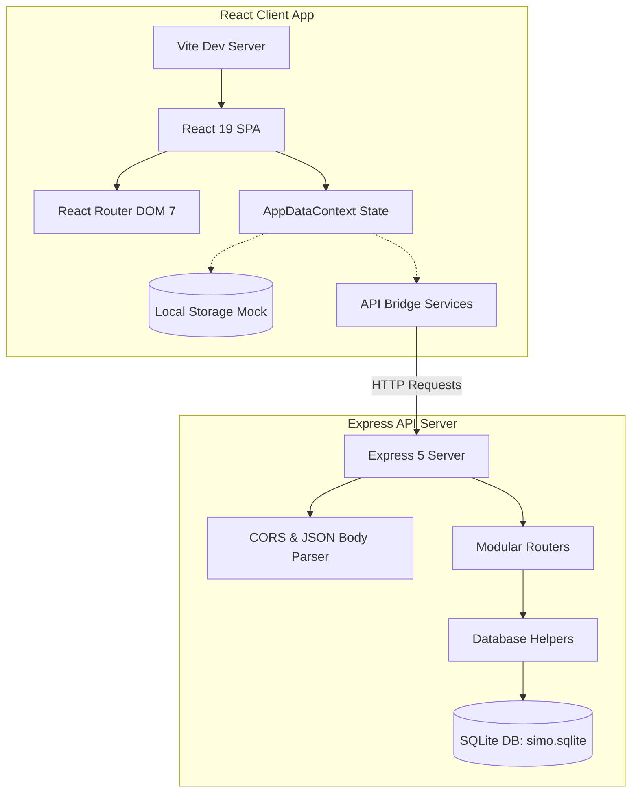
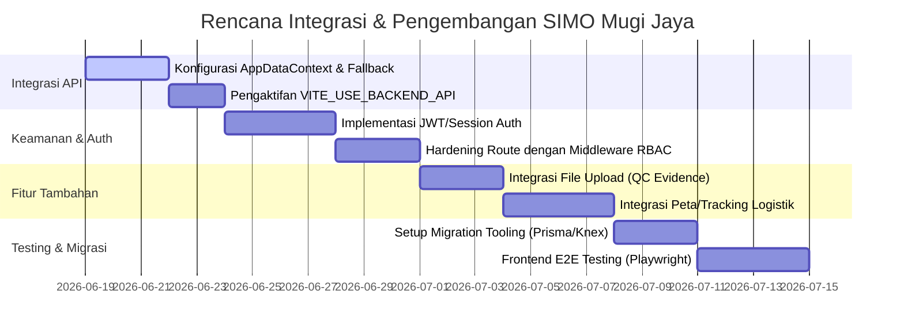

# Laporan Perkembangan Proyek: SIMO Mugi Jaya
**Status Proyek**: Fase Transisi (Frontend Offline Mock -> Integrasi Backend API)  
**Peran**: Senior Software Developer & Software Architecture Specialist  
**Tanggal**: 18 Juni 2026

---

## 1. Ringkasan Eksekutif
SIMO Mugi Jaya adalah purwarupa (prototype) *Operational Management Information System* yang dirancang untuk mengelola proses Produksi, Logistik, dan *Quality Control* (QC). Proyek ini dikembangkan dengan arsitektur terpisah (*decoupled architecture*) yang terdiri dari frontend berbasis Single Page Application (SPA) dan backend RESTful API. 

Saat ini, proyek telah menyelesaikan dua fase pengembangan utama:
- **Day 1 MVP**: Menyelesaikan arsitektur dasar frontend dengan persistensi berbasis `localStorage` untuk mematangkan konsep UI/UX, Alur Kerja (*User Flow*), dan Logika Bisnis (*Business Logic*).
- **Day 2 Backend Foundation**: Menyelesaikan rancangan database SQLite, server RESTful API dengan Express 5, *automated integration tests*, serta *idempotent database seeding*.

---

## 2. Tinjauan Arsitektur Sistem (System Architecture Review)

Sistem ini didesain menggunakan pola arsitektur **Client-Server** yang berorientasi pada kesederhanaan (*simplicity*), modularitas, dan kemudahan pengujian (*testability*).

### A. Arsitektur Frontend
* **Core Framework**: React 19 dengan Vite 8 sebagai *build tool* dan bundler untuk performa tinggi.
* **Styling**: Tailwind CSS v4 untuk *utility-first styling* modern.
* **State Management & Data Flow**: Menggunakan React Context API (`AppDataContext.jsx`). Saat ini, context ini membungkus state aplikasi dan menyimpannya secara reaktif ke `localStorage`. Pola ini sengaja dipasang untuk demo offline sebelum integrasi penuh API.
* **API Bridge Layer**: Terletak di `src/services/` (`apiClient.js`, `workItemsApi.js`, `qcApi.js`, dsb.). Layer ini sudah didefinisikan secara lengkap dengan memanfaatkan `fetch` API, namun masih dinonaktifkan oleh *feature flag* `VITE_USE_BACKEND_API=false`.

### B. Arsitektur Backend
* **Runtime**: Node.js dengan Express 5 (versi terbaru yang memiliki penanganan promise/async handler secara native yang lebih baik).
* **Database**: SQLite melalui driver `sqlite3`. Database disimpan dalam satu file lokal (`server/db/simo.sqlite`), yang memudahkan portabilitas selama fase pengembangan kuliah SEM 6.
* **Dependency Injection (DI)**: Routers tidak mengimpor koneksi database secara langsung. Sebagai gantinya, mereka dibungkus dalam fungsi factory (contoh: `createQcChecklistsRouter(db)`) yang menerima instansiasi `db` dari luar. Pola desain ini mempermudah pembuatan mock database saat pengujian.
* **Keamanan Transaksi**: Operasi kritis seperti submit QC checklist dibungkus dalam transaksi SQLite (`withTransaction` menggunakan `BEGIN IMMEDIATE TRANSACTION`), memastikan perubahan status item dan pencatatan audit log terjadi secara atomik.

---

## 3. Skema Database (Database Schema Layout)

Database SQLite dirancang dengan 7 tabel utama yang saling berelasi erat:

1. **`roles`**: Menyimpan daftar peran sistem (Owner, Production Manager, Foreman, QC Inspector, Admin).
2. **`users`**: Menyimpan data pengguna yang terikat pada peran (`role_id`) dan lokasi kerja (`site`).
3. **`projects`**: Menyimpan data proyek manufaktur beserta metadata seperti batas waktu (`due_date`) dan prioritas.
4. **`warehouses`**: Menyimpan informasi area/gudang produksi yang terikat pada proyek tertentu.
5. **`work_items`**: Menyimpan daftar pekerjaan produksi spesifik (item material, kuantitas, status produksi `To-Do`/`In-Progress`/`Done`, status QC, dan status *shipping gate*).
6. **`qc_checklists`**: Menyimpan rekaman hasil inspeksi QC (dimensi panjang, lebar, ketebalan, catatan, dan referensi foto).
7. **`audit_logs`**: Menyimpan log audit otomatis untuk setiap perubahan status produksi dan inspeksi QC guna kepatuhan standar industri.

*Indeks tambahan telah dipasang pada foreign keys dan kolom pencarian log audit untuk mengoptimalkan performa query pencarian dan penyaringan data.*

---

## 4. Status Implementasi Fitur (Features Checklist)

### A. Fitur yang Telah Selesai (Completed Features)

| Komponen | Fitur | Status | Detail Teknis |
|---|---|---|---|
| **Shared** | Demo Data | KELAR | Data awal konsisten untuk simulasi 5 user dengan peran berbeda. |
| **Frontend** | Role Switcher | KELAR | Mengubah simulasi pengguna aktif secara langsung dari top-bar navigasi. |
| **Frontend** | Dashboard Produksi | KELAR | Menampilkan ringkasan visual, persentase kemajuan proyek, serta beban kerja gudang. |
| **Frontend** | Board Work Items | KELAR | Papan status Kanban (To-Do, In-Progress, Done) dengan interaksi update status cepat. |
| **Frontend** | Digital QC Checklist | KELAR | Form input dimensi material, evaluasi status QC, dan integrasi otomatis ke pintu pengiriman (*shipping gate*). |
| **Frontend** | Audit Trail UI | KELAR | Riwayat log aktivitas sistem dengan penyaringan dinamis dan fitur ekspor ke CSV. |
| **Backend** | REST API Endpoints | KELAR | API CRUD dasar lengkap (lihat daftarnya di `README.md`). |
| **Backend** | Server-side Audit Logging | KELAR | Menulis rekaman log audit secara otomatis di SQLite ketika status pekerjaan atau QC berubah. |
| **Backend** | Transaksi Atomik QC | KELAR | Submit QC dan update status work item dibungkus dalam satu transaksi database. |
| **Backend** | Idempotent Seeding | KELAR | Script `npm run db:seed` yang dapat dijalankan berkali-kali tanpa menduplikasi data yang sudah ada. |
| **Backend** | Integration Testing | KELAR | Suite pengujian integrasi menggunakan modul bawaan `node:test` (tanpa dependensi testing eksternal seperti Jest/Mocha). |

### B. Fitur yang Belum Selesai / Sedang Berjalan (Unfinished & Backlog)
1. **Integrasi Frontend-Backend**: UI frontend belum melakukan *fetching* data asli dari backend server Express. Semua data masih diambil dari `localStorage`.
2. **Autentikasi Nyata (Real Auth)**: Login masih bersifat simulasi *switcher*. Belum ada mekanisme pengamanan route (seperti token JWT atau Cookies Session) di sisi backend.
3. **Upload Foto QC**: Form QC saat ini hanya menerima referensi berupa string nama file foto (`evidence_photo_reference`). Proses upload file biner (*image upload*) belum diimplementasikan.
4. **Halaman Logistik**: Halaman Logistik masih berupa demo statis tanpa interaksi data real.
5. **Database Migration Tooling**: Database schema didefinisikan dalam file SQL mentah (`schema.sql`). Belum ada alat bantu migrasi formal (seperti Knex/Prisma/Sequelize/db-migrate) untuk melacak evolusi skema database ke depannya.

---

## 5. Analisis Kualitas Kode & Praktik Terbaik (Code Quality & Best Practices)

Berdasarkan tinjauan arsitektur, kode program SIMO Mugi Jaya menunjukkan standar kualitas yang sangat baik untuk ukuran proyek perkuliahan (Proyek Pemrograman SEM 6):

1. **Transaction Safety**: Penanganan transaksi di SQLite sangat rapi. File [database.js](file:///d:/Tugas%20kuliah/SEM%206/PROYEK%20PEMRO/Simo-System/server/db/database.js) menyediakan fungsi `withTransaction` yang membungkus operasi SQL menggunakan error handling `try-catch` yang secara otomatis melakukan `ROLLBACK` jika terjadi kegagalan. Ini mencegah inkonsistensi data ketika inspeksi QC berhasil disimpan namun pembaruan status pekerjaan gagal.
2. **Consistent Error Envelope**: Seluruh endpoint backend menggunakan middleware penanganan kesalahan terpusat di [app.js](file:///d:/Tugas%20kuliah/SEM%206/PROYEK%20PEMRO/Simo-System/server/app.js). Setiap respons error memiliki struktur JSON yang seragam (`{ error: { code, message, details } }`), memudahkan frontend untuk melakukan parsing error secara konsisten.
3. **Clean Route Layer**: Logika validasi input diletakkan pada helper HTTP di `server/utils/http.js` (seperti `requireNonEmptyString` dan `requireNonNegativeNumber`). Hal ini menjaga kode rute di [qcChecklists.js](file:///d:/Tugas%20kuliah/SEM%206/PROYEK%20PEMRO/Simo-System/server/routes/qcChecklists.js) tetap bersih, fokus pada orkestrasi data, dan mudah dibaca.
4. **API Bridge Separation**: Pemisahan modul API pada frontend (`src/services/`) menggunakan struktur yang bersih. File-file ini siap digunakan untuk menggantikan mock `localStorage` tanpa perlu mendesain ulang komponen antarmuka pengguna.

---

## 6. Rencana Langkah Selanjutnya (Architecture Roadmap)

Untuk membawa aplikasi ini ke tingkat produksi (*production-ready*), berikut adalah rekomendasi langkah pengembangan selanjutnya:

1. **Fase 1: Integrasi API pada State Context (Frontend API Integration)**
   * Memperbarui [AppDataContext.jsx](file:///d:/Tugas%20kuliah/SEM%206/PROYEK%20PEMRO/Simo-System/src/context/AppDataContext.jsx) agar secara kondisional melakukan fetch ke backend jika `VITE_USE_BACKEND_API=true`.
   * Menerapkan fallback ke `localStorage` jika koneksi backend terputus atau server tidak merespons, untuk menjaga ketahanan aplikasi.

2. **Fase 2: Autentikasi dan Otentikasi (Authentication & Hardening RBAC)**
   * Membuat tabel baru `user_credentials` untuk menyimpan hash kata sandi (menggunakan `bcrypt`).
   * Membuat endpoint `/api/auth/login` yang mengembalikan Token JWT.
   * Menambahkan middleware otentikasi di sisi backend Express untuk memvalidasi JWT tersebut pada rute-rute mutasi data (POST/PATCH/DELETE).
   * Membatasi akses menu UI frontend berdasarkan hak akses yang dikirim dalam klaim JWT (misal: mematikan menu QC jika user adalah Foreman).

3. **Fase 3: Penyimpanan Gambar (QC Evidence Storage)**
   * Mengintegrasikan middleware `multer` pada backend Express untuk menangani upload gambar.
   * Menyimpan file gambar secara lokal di direktori `server/public/uploads` atau menggunakan cloud storage (seperti Cloudinary / AWS S3).
   * Memperbarui field `evidence_photo_reference` untuk menyimpan URL gambar yang valid dan menampilkannya di dashboard QC.

4. **Fase 4: Migrasi Database Formal**
   * Mengadopsi library migrasi seperti Knex.js atau Sequelize CLI.
   * Memindahkan isi dari `schema.sql` menjadi file migrasi bertahap, sehingga jika ada perubahan skema (misal: menambahkan kolom baru di tabel `projects`), perubahan tersebut dapat dilacak dan diterapkan tanpa merusak data lama.
