# Rencana Pengembangan Sistem (Hackathon 1 Jam - Full Stack & Multi-Feature)
**Target Utama**: Migrasi Database PostgreSQL, Integrasi API, Otentikasi JWT, & Fitur Unggah Foto QC  
**Durasi**: 60 Menit  
**Perancang**: Senior Software Developer & Software Architecture Specialist  

---

## 1. Latar Belakang & Urgensi
Sesi hackathon kali ini menargetkan transformasi sistem **SIMO Mugi Jaya** dari prototipe statis offline menjadi aplikasi *enterprise-grade* yang berjalan di atas PostgreSQL dengan sistem keamanan otentikasi JWT dan fitur pengunggahan berkas inspeksi kualitas secara biner.

---

## 2. Alokasi Waktu Kerja (Timeboxing 60 Menit)

```mermaid
gantt
    title Jadwal Hackathon Multi-Feature (60 Menit)
    dateFormat  X
    axisFormat %M
    section Arsitektur DB
    Setup PG, Driver pg, & Seeding PG      :active, 0, 15
    section API & State
    Integrasi AppDataContext & API Bridge  : 15, 30
    section Fitur Keamanan
    Implementasi JWT Auth & Otorisasi RBAC : 30, 45
    section Fitur QC Biner
    Integrasi Multer & Upload Foto QC UI   : 45, 55
    section Verifikasi
    Uji Coba Sistem & Demo ke Dosen        : 55, 60
```

---

## 3. Rencana Implementasi Fitur

### Fitur A: Migrasi Database PostgreSQL & Integrasi REST API (Menit 00 - 30)
* **Deskripsi**: Mengganti SQLite lokal dengan PostgreSQL dan menyambungkan client React agar melakukan fetching data dinamis.
* **Langkah Kerja**:
  1. Hubungkan koneksi database PostgreSQL di `.env` (menggunakan Neon/Supabase/Lokal PG) dan instal driver `pg` (`npm install pg`).
  2. Modifikasi [database.js](file:///d:/Tugas%20kuliah/SEM%206/PROYEK%20PEMRO/Simo-System/server/db/database.js) dengan menulis SQL parser dinamis (`translateSql`) untuk menerjemahkan query SQLite ke PostgreSQL secara otomatis dan amankan transaksi per request dengan **`AsyncLocalStorage`**.
  3. Jalankan `npm run db:seed` untuk mengisi database PostgreSQL.
  4. Perbarui [AppDataContext.jsx](file:///d:/Tugas%20kuliah/SEM%206/PROYEK%20PEMRO/Simo-System/src/context/AppDataContext.jsx) dengan hook `useEffect` untuk memuat data awal secara paralel dari Express API ke state React, serta hubungkan status mutasi status pekerjaan dan QC ke backend REST API.

### Fitur B: Otentikasi JWT & Otorisasi Peran / RBAC (Menit 30 - 45)
* **Deskripsi**: Mengganti simulasi *role switcher* dengan login nyata berpengaman Token JWT dan memblokir halaman terlarang berdasarkan hak akses peran.
* **Langkah Kerja**:
  1. **Backend**: 
     * Buat endpoint `/api/auth/login` untuk memvalidasi kredensial (dengan password default ter-hash).
     * Gunakan library JWT (atau buat helper token sederhana menggunakan modul native `node:crypto` untuk menghemat instalasi) untuk membuat token akses.
     * Buat middleware otentikasi `requireAuth` di server untuk memverifikasi token sebelum mutasi database (POST/PATCH).
  2. **Frontend**:
     * Buat halaman login sederhana untuk menangkap input email dan password.
     * Simpan token JWT hasil login di `localStorage` atau memori aplikasi untuk dikirim di headers request.
     * Modifikasi UI menu samping agar menyembunyikan modul halaman tertentu berdasarkan hak akses user (contoh: menyembunyikan modul **Audit Logs** dari peran Foreman).

### Fitur C: Unggah Foto Bukti QC Aktual (Menit 45 - 55)
* **Deskripsi**: Mengganti input nama file string menjadi pengunggahan file foto bukti fisik QC biner secara riil ke server backend.
* **Langkah Kerja**:
  1. **Backend**:
     * Instal library `multer` (`npm install multer`) untuk memproses berkas multipart/form-data.
     * Konfigurasikan penyimpanan file gambar pada direktori server `server/public/uploads` dan ekspos folder tersebut sebagai file statis di Express.
     * Hubungkan route `POST /api/qc-checklists` agar menerima parameter file gambar dari multer dan menyimpan nama file yang diunggah ke kolom `evidence_photo_reference`.
  2. **Frontend**:
     * Ubah form QC agar menggunakan `<input type="file" accept="image/*">`.
     * Gunakan objek `FormData` untuk mengirimkan data teks formulir beserta file gambar biner saat melakukan submit checklist QC.
     * Tampilkan pratinjau gambar inspeksi di halaman riwayat QC menggunakan tag `` yang bersumber dari URL statis server Express.

### Langkah D: Verifikasi Sistem & Demonstrasi Dosen (Menit 55 - 60)
* **Tujuan**: Memastikan kelancaran sistem end-to-end tanpa kendala integrasi.
* **Langkah Kerja**:
  1. Jalankan `npm run dev:all` untuk menguji keselarasan frontend dan server API.
  2. Lakukan alur pengujian lengkap: Login ➡️ Ambil data dari Postgres ➡️ Ubah status Pekerjaan ➡️ Submit QC dengan upload gambar fisik ➡️ Log audit tercatat otomatis ➡️ Logout.

---

## 4. Nilai Tambah Arsitektur yang Sangat Kuat
Tunjukkan kelebihan arsitektur ini kepada dosen Anda:
1. **Zero SQL Rewrite**: Migrasi database ke PostgreSQL selesai dalam 15 menit menggunakan layer penerjemah SQL dinamis tanpa menyentuh file query route Express.
2. **State & Request-Scoped Transaction**: Penggunaan `AsyncLocalStorage` menjamin transaksi database aman dari bahaya kebocoran data (*race conditions*) antar-request paralel.
3. **Stateless Authentication**: Menggunakan JWT yang disimpan di client-side, mengurangi beban server dalam mengelola data session.
4. **Binary Storage Integration**: Penanganan file biner menggunakan `multer` memisah penyimpanan database (hanya menyimpan teks nama berkas) dengan penyimpanan fisik sistem berkas server untuk performa database yang efisien.
